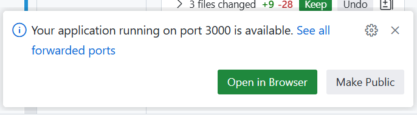

# Lab 0 — Core Guided: Work with a Codespace

**Goal:** Start a Codespace, add your chosen language stack to the dev container, run the app, and commit your changes.

**Time:** 20 minutes

**You will need:** A GitHub account with Codespaces access (included in the free tier).

---

## Steps

### 1. Create your repo and start a Codespace

1. Open the workshop repo in your browser: [github.com/Ba4bes/Creating-Apps-with-GitHub](https://github.com/Ba4bes/Creating-Apps-with-GitHub/)
2. Click **Use this template** → **Create a new repository**, fill in a repository name, and click **Create repository**
3. In your new repository, click the green **Code** button → **Codespaces** tab → **Create codespace on main**

   

4. Wait for the Codespace to open — this should be quick because the base image is lightweight

### 2. Add your language to the dev container

The Codespace starts with a minimal base image — no language runtimes are installed. You will now add your chosen language.

5. Open `.devcontainer/devcontainer.json` in the editor. It looks like this:

   ```json
   {
     "name": "Creating Apps with GitHub",
     "image": "mcr.microsoft.com/devcontainers/base:ubuntu",
     "customizations": {
       "vscode": {
         "extensions": [
           "GitHub.copilot",
           "GitHub.copilot-chat"
         ],
         "settings": {
           "editor.formatOnSave": true
         }
       }
     }
   }
   ```

6. Pick **one** language and add the corresponding configuration. Use the tabs below for your language:

   **Node:**
   ```json
   {
     "name": "Creating Apps with GitHub",
     "image": "mcr.microsoft.com/devcontainers/base:ubuntu",
     "features": {
       "ghcr.io/devcontainers/features/node:1": {}
     },
     "customizations": {
       "vscode": {
         "extensions": [
           "GitHub.copilot",
           "GitHub.copilot-chat",
           "dbaeumer.vscode-eslint"
         ],
         "settings": {
           "editor.formatOnSave": true
         }
       }
     },
     "forwardPorts": [3000],
     "postCreateCommand": "cd node && npm install"
   }
   ```

   **Python:**
   ```json
   {
     "name": "Creating Apps with GitHub",
     "image": "mcr.microsoft.com/devcontainers/base:ubuntu",
     "features": {
       "ghcr.io/devcontainers/features/python:1": {}
     },
     "customizations": {
       "vscode": {
         "extensions": [
           "GitHub.copilot",
           "GitHub.copilot-chat",
           "ms-python.python"
         ],
         "settings": {
           "editor.formatOnSave": true
         }
       }
     },
     "forwardPorts": [5000],
     "postCreateCommand": "cd python && pip install -r requirements.txt"
   }
   ```

   **.NET:**
   ```json
   {
     "name": "Creating Apps with GitHub",
     "image": "mcr.microsoft.com/devcontainers/base:ubuntu",
     "features": {
       "ghcr.io/devcontainers/features/dotnet:2": {
         "version": "10.0"
       }
     },
     "customizations": {
       "vscode": {
         "extensions": [
           "GitHub.copilot",
           "GitHub.copilot-chat",
           "ms-dotnettools.csdevkit"
         ],
         "settings": {
           "editor.formatOnSave": true
         }
       }
     },
     "forwardPorts": [5001],
     "postCreateCommand": "cd dotnet && dotnet restore && cd Api.Tests && dotnet restore"
   }
   ```

7. Save the file. A notification will appear asking if you want to rebuild the container. Click **Rebuild Now**

   If the notification does not appear, open the Command Palette (`Ctrl+Shift+P`) and run **Dev Containers: Rebuild Container**

8. Wait for the rebuild to complete. After rebuild, your language runtime and dependencies will be installed automatically

### 3. Run the app

9. Once the terminal prompt appears, start the API for your chosen language:

   **Node:**
   ```bash
   cd node && npm start
   ```

   **Python:**
   ```bash
   cd python && flask run --port 5000
   ```

   **.NET:**
   ```bash
   cd dotnet && dotnet run
   ```

10. A notification appears at the bottom-right of the screen when the port is forwarded

    

11. Click **Open in Browser** to open the app in a new tab and confirm it is running

### 4. Commit and push your changes

12. Open `README.md` in the editor
13. Add your name to the top of the file
14. Open the **Source Control** panel from the left sidebar (or press `Ctrl+Shift+G`)
15. Stage all changes (the devcontainer update and the README change), add a commit message such as `Add language setup and name to README`, and click **Commit**
16. Click **Sync Changes** to push the commit to your repository
17. Open your repository on GitHub.com in a browser tab and confirm the changes are visible

### 5. Stop and delete the Codespace

18. Go back to your repository on GitHub.com in your browser
19. Click the green **Code** button → **Codespaces** tab
20. Click the **...** menu next to your running Codespace and select **Stop codespace**

> Note: you don't need to stop the codespace before deleting it. This exercise is just to prove the point that you can stop and restart a codespace without losing your work.

21. Once it has stopped, click the **...** menu again and select **Delete**

**Expected result:** The dev container is configured for your language, the app runs, and all changes are committed and pushed. The Codespace is stopped and deleted.

> **Troubleshooting:** If the port notification does not appear, open the **Ports** tab at the bottom of the Codespace, find the forwarded port, and click the globe icon to open it in a browser tab.
